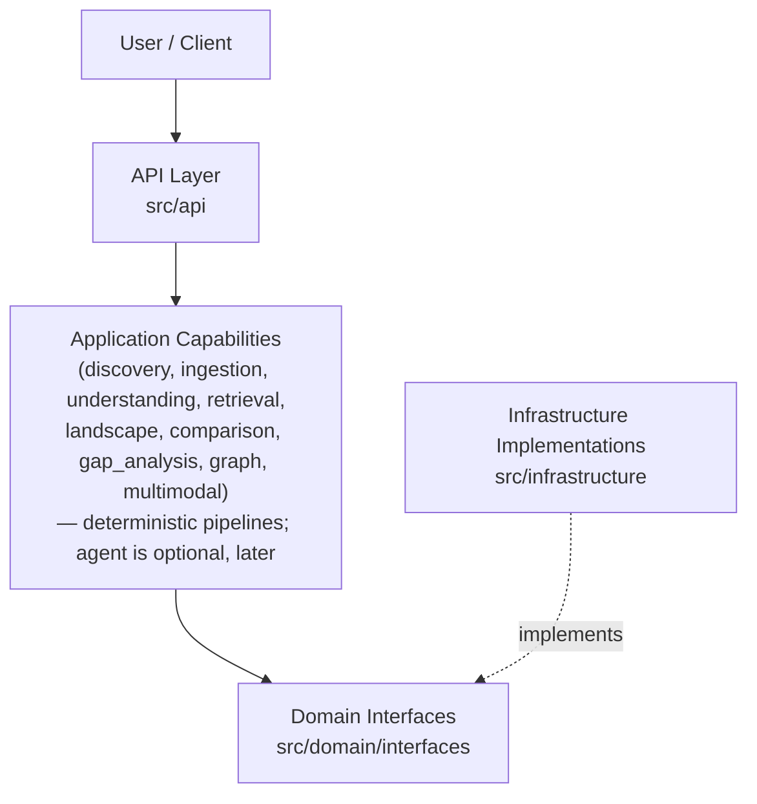
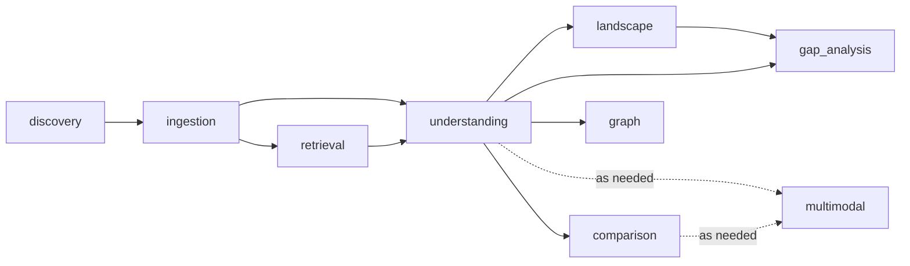
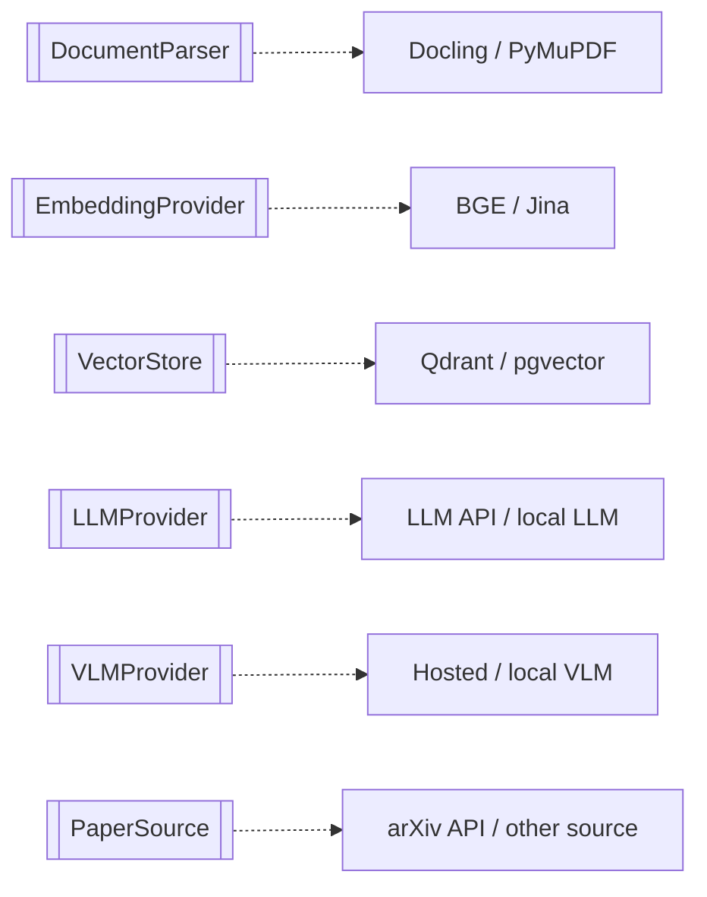
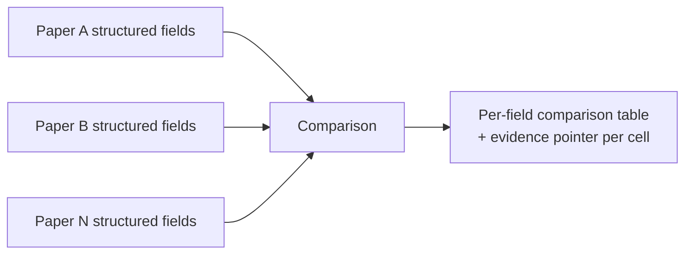
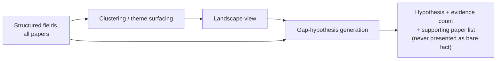
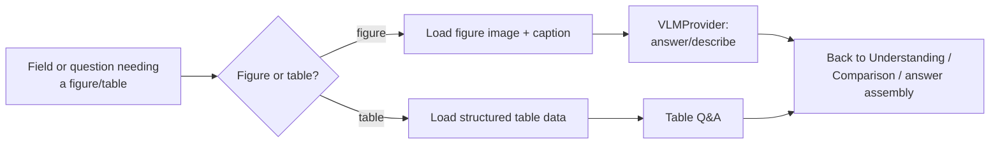
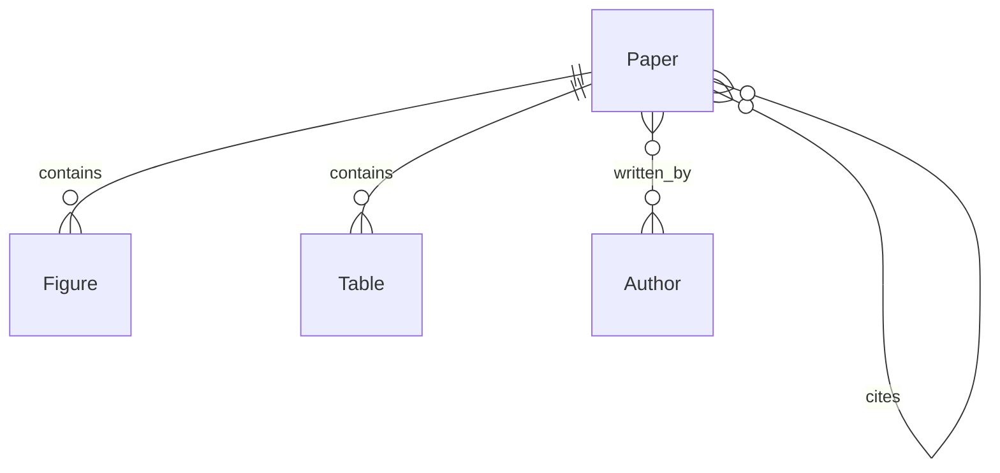
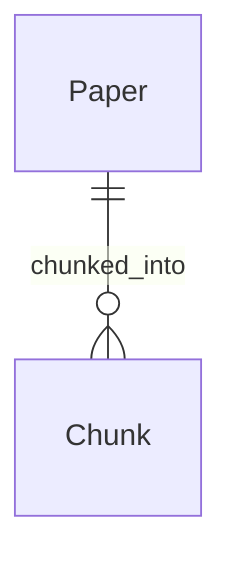
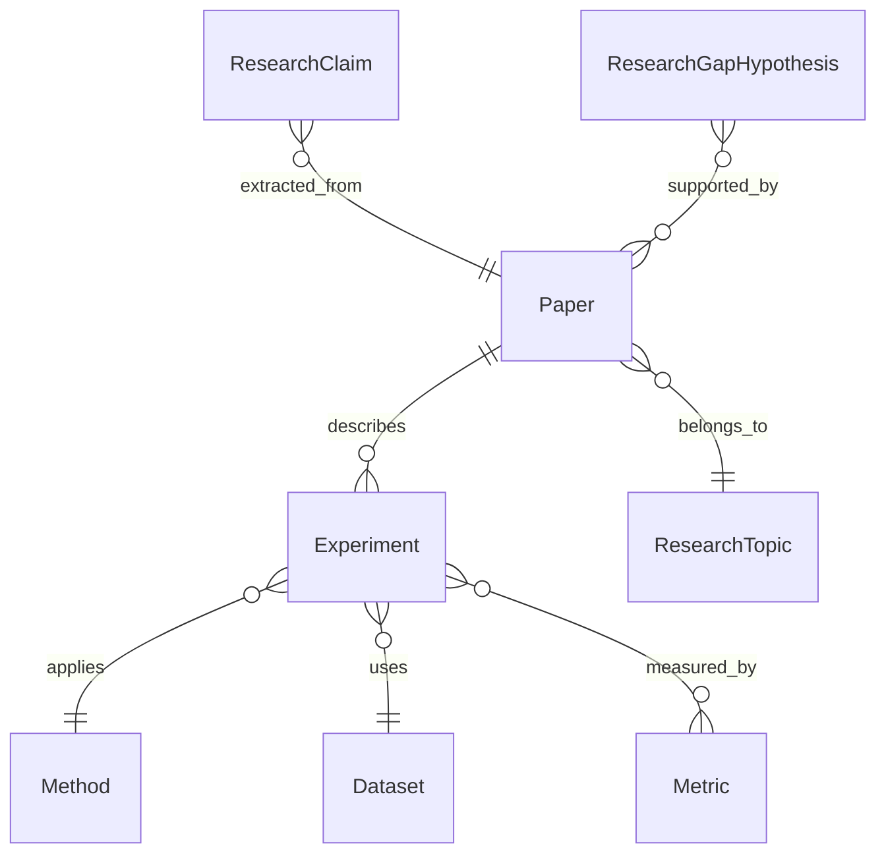

# Architecture

**Status:** Sprints 1–3 implemented (Ingestion, Discovery/Retrieval, Understanding);
everything past that is still conceptual design — see `implementation-plan.md` for
what's actually built vs. planned per sprint.
**Last updated:** 2026-09-23

This document describes the intended architecture of the Research Intelligence
Platform. Most of it is still a design document, not a record of what exists — only
the components marked implemented in §3 have real code behind them. §8's interface
table lists every candidate implementation without marking which was actually
picked; that decision (and why) lives in `decisions.md`'s ADRs (ADR-014 for
`DocumentParser`, ADR-015 for `EmbeddingProvider`/`VectorStore`, ADR-016 for
`LLMProvider`).

## 0. Positioning: What This Architecture Is For

The product's core unit of intelligence is a **collection of papers**, not a single
document. The architecture is organized around the conceptual workflow:

```
Paper Sources → Discovery → Ingestion → Understanding → Research Landscape
              → Comparison → Gap Analysis → Research Graph
```

RAG, VLMs, and agentic orchestration are **supporting technologies**, used where they
add clear, demonstrable value (grounded evidence retrieval; figure/diagram/table
understanding; later, multi-step workflow automation). They are not the architecture's
organizing principle, and single-document Q&A is a byproduct of the Retrieval and
Understanding layers, not a top-level capability in its own right. Deterministic
pipelines are preferred over agentic ones wherever they are sufficient — see ADR on
agentic workflows in `decisions.md`.

## 1. System Context

```mermaid
flowchart LR
    User([User])
    System[["Research Intelligence Platform"]]
    Sources[(External Paper Sources\ne.g. arXiv)]
    LLM[(LLM Provider)]
    VLM[(VLM Provider)]
    VDB[(Vector Database)]
    RDB[(Relational / Graph-capable Database)]
    FS[(File / Object Storage)]

    User -->|curates collection, asks questions,\nrequests comparisons| System
    System -->|structured knowledge, comparisons,\nlandscape views, gap hypotheses| User
    System -->|search / fetch metadata (future)| Sources
    System -->|text generation, extraction| LLM
    System -->|figure/table understanding| VLM
    System -->|similarity search| VDB
    System -->|papers, structured entities, relationships| RDB
    System -->|raw PDFs, extracted figures| FS
```

## 2. High-Level Architecture

Requests flow downward; dependencies point **inward**, toward domain interfaces, never
outward toward a specific vendor SDK or a specific paper source. This is shown as three
separate views, each answering one question, rather than one dense diagram — the three
questions don't need to be read together.

### 2.1 Layers — "what depends on what"



**Dependency direction, stated explicitly:** the application layer and the
infrastructure layer both depend *on* `domain/interfaces`; the domain layer depends on
nothing outside itself. Infrastructure implementations are injected (via
configuration/factory) into the application layer at startup — application code never
imports a vendor SDK or a specific paper-source client directly.

### 2.2 Capability Dependencies — "what feeds what"

Within the application layer, this is the actual data dependency between capabilities
(who consumes whose output), following the conceptual workflow in §0:



`agent` (future, optional) is not shown here — it does not participate in this pipeline;
instead it orchestrates *across* these capabilities once they each work independently
(see ADR-006/ADR-012 in `decisions.md`).

### 2.3 Interfaces → Candidate Implementations — "what's swappable"



Which capability uses which interface is listed per-component in §3, not repeated here —
see the table below.

## 3. Component Responsibilities

| Component | Location | Responsibility | Interfaces used (§2.3) |
|---|---|---|---|
| API layer | `src/api` | HTTP endpoints, request validation, response schemas, error translation. No business logic. | — |
| Domain models | `src/domain/models` | Core entities: Paper, Author, ResearchTopic, Method, Dataset, Metric, Experiment, Figure, Table, Citation, ResearchClaim, ResearchGapHypothesis (see §7). | — |
| Domain schemas | `src/domain/schemas` | Shared validation/serialization schemas used across layers, independent of API-specific request/response shape. | — |
| Domain interfaces | `src/domain/interfaces` | Abstract contracts: `LLMProvider`, `VLMProvider`, `EmbeddingProvider`, `VectorStore`, `DocumentParser`, `PaperSource`. No implementation. | — |
| Discovery | `src/discovery` | Collects/curates the paper collection; MVP scope: reads back an already-ingested manual/local collection (FR-020) via `LocalCollectionPaperSource`; later, searches external sources, ranks, dedups, filters. | `PaperSource` |
| Ingestion | `src/ingestion` | Orchestrates parsing a PDF into domain models (text/tables/figures/references/pages) and persisting them; also the read side (`load_paper`) Discovery uses to hydrate a persisted paper back. Does not itself chunk/embed/index — see Retrieval. | `DocumentParser` |
| Understanding | `src/understanding` | Extracts structured fields per paper (problem, method, dataset, metrics, results, limitations — FR-030–FR-035), each retaining an evidence pointer resolved from real retrieved chunks, never LLM-reported (ADR-009, ADR-016). | `LLMProvider`, `VectorStore` (via `RetrievalPipeline`) |
| Retrieval | `src/retrieval` | Chunking, embedding, and indexing (`indexing.py`, the write path) plus query embedding/similarity search/(future) reranking (`retrieval.py`, the read path) — a supporting capability used by Understanding, Comparison, and grounded Q&A. | `EmbeddingProvider`, `VectorStore` |
| Landscape | `src/landscape` *(created when Sprint 4 needs it)* | Clusters papers by theme/direction; surfaces method–dataset relationships across the collection. | (via Understanding output) |
| Comparison | `src/comparison` *(created when Sprint 5 needs it)* | Compares 2+ papers across structured fields (from Understanding), preserving evidence traceability per compared field. | `LLMProvider` |
| Gap analysis | `src/gap_analysis` *(created when Sprint 6 needs it)* | Identifies candidate underexplored combinations/recurring limitations from Landscape/Understanding output; always emits hypotheses with supporting evidence, never bare claims. | (via Landscape/Understanding output) |
| Graph | `src/graph` *(created when Sprint 7 needs it)* | Represents paper–paper, paper–method, paper–dataset, paper–author, paper–topic relationships. | (via Understanding output) |
| Multimodal | `src/multimodal` | Figure/table understanding orchestration via VLM — a supporting capability invoked by Understanding/Comparison when a question or field depends on a figure or table, not a standalone product surface. | `VLMProvider` |
| Agent | `src/agent` *(future, optional)* | Not a primary product category. A later, optional orchestration layer that dynamically sequences the deterministic capabilities above for multi-step workflows, once those capabilities are independently proven. | (orchestrates other capabilities, not interfaces directly) |
| Tools | `src/tools` *(created alongside the agent layer, when it exists)* | Discrete, agent-invocable wrappers around the capabilities above, needed only once dynamic tool selection (agent) exists. | — |
| Infrastructure | `src/infrastructure` | Concrete implementations of domain interfaces for specific vendors/libraries/sources. | implements all of §2.3 |
| Evaluation | `tests/evaluation` | Evaluation harness and datasets exercising discovery, extraction, retrieval, comparison, clustering, and gap-analysis metrics (see `evaluation.md`). | — |

Directories marked *(created when Sprint N needs it)* do not exist yet in this
repository — they are documented here as the target architecture, not scaffolded ahead
of need (see `development-guidelines.md`, "do not over-engineer").

## 4. Data Flow

### 4.1 Ingestion Pipeline (Sprint 1)

Ends at persisted structured output — chunking/embedding/indexing is Retrieval's job
(§4.2), reading that output back rather than running inline during ingestion (see
ADR-015): this keeps a paper's parse from having to be redone every time the
embedding model changes, and keeps `DocumentParser`'s dependency graph free of
`EmbeddingProvider`/`VectorStore`.

```mermaid
flowchart LR
    A[PDF collection] --> B[DocumentParser\n(interface)]
    B --> C{Extracted content}
    C --> D[Text blocks + page metadata]
    C --> E[Tables]
    C --> F[Figures + captions]
    C --> R[References / citations]
    E --> J[(Structured store:\ntable data)]
    F --> K[(File storage:\nfigure images)]
    D --> L[(Structured store:\npage/text metadata)]
    R --> M[(Structured store:\nreferences)]
```

### 4.2 Retrieval Pipeline (Sprint 2, supporting capability)

Two flows: indexing (write path, `src/retrieval/indexing.py`) reads Sprint 1's
persisted papers back via `PaperSource` and populates the vector store; query (read
path, `src/retrieval/retrieval.py`) is the one architecture.md originally sketched.

```mermaid
flowchart LR
    P[(Persisted papers,\n§4.1 output)] --> PS[PaperSource:\nlist_papers]
    PS --> CH[Chunking\n(pure function)]
    CH --> EMB[EmbeddingProvider:\nembed_documents]
    EMB --> UP[VectorStore:\nupsert]
```

```mermaid
flowchart LR
    Q[Question / extraction target] --> QE[EmbeddingProvider:\nembed_query]
    QE --> VS[VectorStore:\nquery\n(paper-scoped filter optional)]
    VS --> R[Top-K chunks\n+ provenance]
    R --> CONS[Understanding / Comparison /\ngrounded answer assembly]
```

### 4.3 Understanding Pipeline (Sprint 3 — implemented)

As built: `collect_labeled_evidence` runs one fixed `RetrievalPipeline.retrieve()`
query per FR-030–035 field, pools/de-duplicates/labels the results (`E1, E2, ...`),
and one `LLMProvider.complete()` call per paper (not per field) returns JSON citing
only those labels; `parse_extraction_response` resolves each cited label back to a
real `EvidencePointer` — the LLM never emits a page/chunk_id itself (ADR-009,
ADR-016). `STORE` below is `understanding.json` per paper (`src/understanding/
persistence.py`), sibling to Sprint 1's `metadata.json`.

```mermaid
flowchart LR
    P[Paper] --> RET[Retrieve + label evidence\nper FR-030-035 field]
    RET --> PROMPT[Build one prompt\nwith labeled evidence]
    PROMPT --> LLM[LLMProvider.complete():\nextract problem/method/\ndataset/metric/result/limitation]
    LLM --> PARSE[Parse JSON, resolve\ncited labels to real\nEvidencePointers]
    PARSE --> S[PaperUnderstanding\n+ evidence pointer each]
    S --> STORE[(understanding.json)]
```

### 4.4 Comparison Pipeline (Sprint 5)



### 4.5 Landscape + Gap Analysis Pipeline (Sprints 4 and 6)



### 4.6 Multimodal Pipeline (supporting capability, invoked from Understanding/Comparison)



## 5. API Layer

The API layer (`src/api`) exposes platform capabilities over HTTP (FastAPI, candidate):
paper ingestion, retrieval/Q&A, and — as each sprint delivers them — understanding,
comparison, landscape, gap-analysis, and graph endpoints. It depends only on the
application layer and domain schemas/models — never directly on infrastructure
implementations.

## 6. Storage Layer

Three distinct storage concerns, kept separate so each can be swapped independently:

- **Vector storage** (embeddings for retrieval) — candidate: Qdrant, alternative: pgvector.
- **Relational/structured storage** (papers, authors, methods, datasets, metrics,
  experiments, citations, gap hypotheses) — candidate: PostgreSQL. This store is expected
  to grow relationship-heavy (§7); PostgreSQL is kept as the candidate for the MVP, with
  a graph database evaluated later (Sprint 7) only if relational modeling proves
  insufficient for the Research Graph capability — see `decisions.md`.
- **File/object storage** (raw PDFs, extracted figure images) — candidate: local
  filesystem under `data/` for MVP, swappable for object storage later.

## 7. Domain Model (Conceptual — Documentation Only at Phase 0)

The following entities and relationships are the target domain model. They are
documented here to guide `src/domain/models` design in later sprints; **only entities
needed by the current sprint are implemented** (Sprint 1: Paper, Page, TextBlock,
Table, Figure, Citation; Sprint 2 adds Chunk — see `implementation-plan.md`). Split
into three parts below — what a paper *contains* (§7.1, Sprint 1), the retrievable
units derived from it (§7.2, Sprint 2), and what gets *interpreted* from it (§7.3,
Sprint 3+) — since mixing these in one diagram is what made it hard to read.

### 7.1 Paper Content (Sprint 1 — Ingestion)

What's extracted directly from a PDF, with no interpretation involved. The diagram
below shows cross-entity *relationships* only; `Page`, `TextBlock`, and `Section` are
page-level content owned entirely by one `Paper` (no interesting relationship to
diagram) and are listed in the table beneath it instead — see ADR-014 in
`decisions.md` for why `Section` was added to Sprint 1's scope.



| Entity | Description |
|---|---|
| `Paper` | A single ingested paper: metadata, text, tables, figures, references. |
| `Author` | A paper author (name; future: affiliation, identifiers). |
| `Page` | Page-level metadata and extraction health (text length, whether extraction hit a problem) for one page. |
| `TextBlock` | A contiguous block of body text with page provenance and reading-order index. |
| `Section` | A heuristically detected section heading (e.g. "Introduction"), with page provenance — best-effort, not guaranteed complete (ADR-014). |
| `Figure` | An extracted figure/diagram/chart with page provenance. |
| `Table` | An extracted table with page provenance. |
| `Citation` | A reference from one paper to another (or to external work) — the edge label `cites` above; modeled as its own entity once graph queries need edge metadata (Sprint 7). |

### 7.2 Retrieval Units (Sprint 2 — Retrieval)

Neither raw-parsed (§7.1) nor LLM-interpreted (§7.3): a `Chunk` is a deterministic
transformation of `TextBlock` (chunking, see ADR-015) — the unit actually embedded
and stored for similarity search.



| Entity | Description |
|---|---|
| `Chunk` | A retrievable unit of evidence (paper_id + page + text), close to 1:1 with a `TextBlock`; `source_block_id` traces it back to its origin (NFR-011). |

### 7.3 Research Knowledge (Sprint 3+ — Understanding, Landscape, Gap Analysis)

What's *interpreted* from a paper's content — every entity here traces back to a
`Paper` and, per NFR-011, ultimately to specific evidence within it. `Method`,
`Dataset`, `Metric`, and `Experiment` are implemented (Sprint 3, `src/domain/
models/`); `ResearchTopic`, `ResearchClaim`, and `ResearchGapHypothesis` remain
future (Sprint 4/6+) design, not yet built:



| Entity | Description |
|---|---|
| `ResearchTopic` | A theme/direction a paper is grouped under (Landscape capability, not yet built). |
| `Method` | A model/algorithm/technique referenced by a paper — implemented, `evidence: list[EvidencePointer]` + `determination: "stated"\|"inferred"`. |
| `Dataset` | A dataset used for evaluation — implemented, same evidence/determination shape as `Method`. |
| `Metric` | An evaluation metric used to report results — implemented, same shape. |
| `Experiment` | A specific method+dataset+metric+result combination within a paper — the join point between a `Paper` and the `Method`/`Dataset`/`Metric` it used, referenced by id, not embedded — implemented. |
| `ResearchClaim` | A generated statement (answer, comparison cell, landscape summary) with a traceable evidence pointer (NFR-011) — not yet built. Sprint 3's `research_problem`/`limitations` fields are **not** modeled as `ResearchClaim`; they use a separate, narrower `EvidencedStatement` type (`src/understanding/models.py`, not yet promoted to this diagram) — see ADR-016 for why this ER diagram had no entity for them and the resolution chosen. |
| `ResearchGapHypothesis` | A candidate gap, always carrying supporting/contradicting evidence counts and a paper list (NFR-012) — not yet built. |

## 8. Replaceability — What "Provider Independence" Means Concretely

Each of the following is defined as an interface in `src/domain/interfaces`, with zero
references to vendor-specific or source-specific types leaking into `src/domain` or any
application-layer package:

| Interface | Candidate implementations | Selected via |
|---|---|---|
| `DocumentParser` | Docling, PyMuPDF | config |
| `EmbeddingProvider` | BGE, Jina | config |
| `RerankerProvider` | BGE reranker, Jina reranker | config |
| `VectorStore` | Qdrant, pgvector | config |
| `LLMProvider` | Hosted API (e.g. OpenAI-compatible), local LLM | config — `OpenAICompatibleLLMProvider` implemented (Sprint 3, ADR-016), mirrors ADR-015's cross-reference pattern for `EmbeddingProvider`/`VectorStore` |
| `VLMProvider` | Hosted API, local VLM | config |
| `PaperSource` | arXiv API, other future sources | config |

Swapping a provider means: (1) implement the interface in `src/infrastructure`, (2)
register it in the configuration-driven factory, (3) no changes to domain or application
code. This is a design target to validate during implementation, not a guarantee that
exists yet.

## 9. Differentiation From a Generic PDF Chatbot

A generic "chat with PDF" tool answers questions about one document in isolation. This
architecture is built around a collection: Understanding extracts comparable structured
fields per paper specifically so that Comparison, Landscape, and Gap Analysis can operate
*across* papers. Retrieval and single-document Q&A exist as supporting capabilities that
Understanding and Comparison are built on — not as the top-level product loop. This
ordering (multi-paper structured knowledge > evidence traceability > landscape > gap
investigation, over conversational single-PDF Q&A) is a first-class architectural
decision — see `decisions.md`.

## 10. Non-goals of This Architecture

- It does not assume a specific deployment topology (single container vs. multiple
  services) beyond "runs via Docker Compose locally" for the MVP.
- It does not assume horizontal scalability requirements.
- It does not lock in LangGraph or any agent framework — agentic orchestration is a
  future, optional layer on top of deterministic pipelines, not an initial architecture
  driver (see `decisions.md`).
- It does not commit to a graph database — the Research Graph capability (Sprint 7) may
  be served by relational modeling in PostgreSQL initially, with a dedicated graph store
  evaluated only if warranted by real query patterns.
